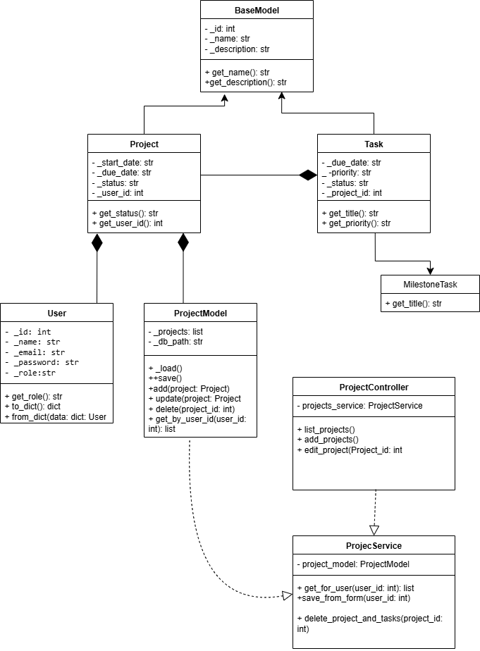

# OrganizaDev 🚀

## Descrição do Projeto

OrganizaDev é uma aplicação web desenvolvida em Python com o framework Bottle. O sistema funciona como um gestor de projetos e tarefas (similar ao Trello ou Asana), permitindo que utilizadores se registem, criem projetos, e adicionem tarefas a esses projetos. A aplicação foi desenhada com uma arquitetura robusta (MVC), um sistema de autenticação seguro e controle de permissões baseado em papéis (admin/regular).

Este projeto foi desenvolvido como parte da avaliação acadêmica, focando na aplicação de conceitos fundamentais e avançados de Orientação a Objetos e desenvolvimento web.

---

## Funcionalidades Principais

* **Gestão de Utilizadores:**
    * Sistema completo de **Registo** e **Login**.
    * Sessões de utilizador geridas por cookies seguros.
    * Sistema de **Permissões** com dois papéis: `admin` e `regular`.

* **Gestão de Projetos:**
    * Funcionalidade **CRUD** completa (Criar, Ler, Atualizar, Excluir) para projetos.
    * Os projetos são associados ao utilizador que os criou; um utilizador só pode ver e gerir os seus próprios projetos.

* **Gestão de Tarefas:**
    * Funcionalidade **CRUD** completa para tarefas, associadas a um projeto específico.
    * Implementação de **Polimorfismo** com dois tipos de tarefas: Tarefas Normais e **Tarefas Marco (Milestone)**, que são exibidas com um destaque visual.

* **Segurança e Qualidade:**
    * **Rotas Protegidas:** A maioria das páginas só é acessível após o login.
    * **Acesso Restrito:** Páginas como a de gestão de utilizadores só são acessíveis a administradores.
    * **Tratamento de Erros:** Páginas de erro 403 (Acesso Proibido) e 404 (Não Encontrado) personalizadas.

* **Arquitetura e Conceitos de OO:**
    * **Estrutura MVC-like:** Código organizado em Models, Views, Controllers e Services.
    * **Herança:** Uso de uma `BaseModel` para partilhar código comum entre os modelos.
    * **Encapsulamento:** Atributos de modelo protegidos e acedidos via métodos.

---

## Arquitetura do Projeto

A aplicação segue uma estrutura inspirada no padrão MVC para separar as responsabilidades:

* **`controllers/`**: Contém as classes responsáveis por lidar com as rotas da aplicação (ex: `project_controller.py`).
* **`models/`**: Define as classes que representam os dados da aplicação (ex: `User`, `Project`).
* **`services/`**: Responsável pela lógica de negócio e pela manipulação dos dados, fazendo a ponte entre os controllers e os models.
* **`views/`**: Contém os ficheiros `.tpl` utilizados pelo Bottle como páginas HTML.
* **`static/`**: Contém ficheiros estáticos como CSS, imagens e JavaScript.
* **`data/`**: Armazena os ficheiros `.json` que simulam a base de dados.

---

## Diagrama de Classes



---

## Tecnologias Utilizadas
* **Backend:** Python 3
* **Framework Web:** Bottle
* **Frontend:** HTML5, CSS3, Bootstrap 5 (via CDN)
* **Persistência de Dados:** Ficheiros JSON

---

## Como Executar o Projeto

Para executar o projeto localmente, siga estes passos:

1.  **Clone o repositório:**
    ```bash
    git clone <URL_DO_SEU_REPOSITORIO_AQUI>
    cd OrganizaDev
    ```

2.  **Crie e ative um ambiente virtual:**
    ```bash
    # Criar o ambiente
    python -m venv venv

    # Ativar no Windows
    .\venv\Scripts\activate

    # Ativar no macOS/Linux
    source venv/bin/activate
    ```

3.  **Instale as dependências:**
    ```bash
    pip install -r requirements.txt
    ```

4.  **Execute a aplicação:**
    ```bash
    python main.py
    ```

5.  **Aceda à aplicação:**
    * Abra o seu navegador e vá para `http://localhost:8080`.

---

## Utilizadores de Teste

Pode usar as seguintes credenciais para testar a aplicação:

* **Administrador:**
    * **Email:** `admin@email.com`
    * **Password:** `123`
* **Utilizador Regular:**
    * **Email:** `user@email.com`
    * **Password:** `123`

---

## Créditos

Este projeto foi desenvolvido com base no template didático de Programação Orientada a Objetos do Prof. Lucas Boaventura, da Universidade de Brasília (UnB).